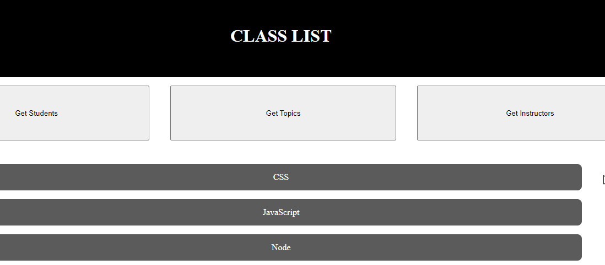

# Student API

This API can be used for getting data on students, instructors, and topics for the UNC Coding Bootcamp. I worked with Tom Erickson and Michelle Wood during the Saturday (01/08/2022) class session to live code and get as close to the original as possible.

All data will be returned in JSON format.

Note: Original application created by Tom Erickson

Link to original version: https://github.com/ericksont11/student-api-frontend

Technologies Used:
* HTML
* CSS
* JavaScript

## API Calls

```
Student Information: https://student-project-api.herokuapp.com/students
```

```
List of Instructors: https://student-project-api.herokuapp.com/instructors
```

```
List of Topics: https://student-project-api.herokuapp.com/topics
```

Link to live site: https://reinholz36.github.io/student-api-frontend-/

<a href="https://reinholz36.github.io/student-api-frontend-/">

</a>